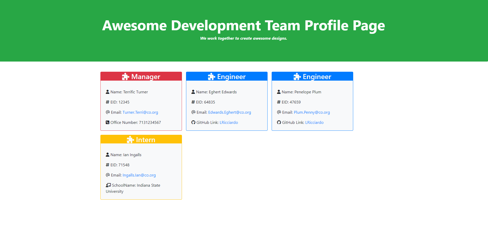

# MOD10-C-TeamProfile-Generator 
--- Team Profile Generator

[](https://opensource.org/licenses/MIT)

## Description
This application takes user input and creates a HTML file for the team profile. Future fixes include formatting the office phone number.

## Table of Contents
  
- [User Story](#userstory)
- [Acceptance Criteria](#acceptance-criteria)
- [Visual Documentation](#visual-documentation)
- [Installation](#installation)
- [Usage](#usage)
- [Credits](#credits)
- [License](#license)
- [Feature](#features)
- [How to Test](#test)

## User Story

```
AS A manager
I WANT to generate a webpage that displays my team's basic info
SO THAT I have quick access to their emails and GitHub profiles
```

## Acceptance Criteria

```
GIVEN a command-line application that accepts user input
WHEN I am prompted for my team members and their information
THEN an HTML file is generated that displays a nicely formatted team roster based on user input
WHEN I click on an email address in the HTML
THEN my default email program opens and populates the TO field of the email with the address
WHEN I click on the GitHub username
THEN that GitHub profile opens in a new tab
WHEN I start the application
THEN I am prompted to enter the team manager’s name, employee ID, email address, and office number
WHEN I enter the team manager’s name, employee ID, email address, and office number
THEN I am presented with a menu with the option to add an engineer or an intern or to finish building my team
WHEN I select the engineer option
THEN I am prompted to enter the engineer’s name, ID, email, and GitHub username, and I am taken back to the menu
WHEN I select the intern option
THEN I am prompted to enter the intern’s name, ID, email, and school, and I am taken back to the menu
WHEN I decide to finish building my team
THEN I exit the application, and the HTML is generated
```

## Visual Documentation

The following image shows the screenshot of the HTML generated by the application:

[]

The click on the picture to shows a video of the application being used from the command line:

[](https://drive.google.com/file/d/1gMGFiHTXyfKjUZBwP5naEVkwlAbmAevV/view?usp=share_link)

## Installation

 1. Initialize npm -- type: ```npm install```  
 2. Run node -- type: ```npm start```


## Usage
Languages used in this project: Markdown,JavaScript with Node.js,HTML with Bootstrap 

## Credits

I researched online and had help from Melissa(class TA)when I got confused.

## License

This application is using the The MIT License License. Click on the badge  [](https://opensource.org/licenses/MIT)  to follow the link to the license.

---

## Features

working with OOP program design.

## How to Contribute

This application follows the [Contributor Covenant](https://www.contributor-covenant.org/).

If you would like to contribute it, you can create an issue on GitHub repository at https://github.com/LRicciardo/MOD10-C-TeamProfile-Generator. 

## Tests

node jest will test the code from the testing areas
  
## Contact Info

This application follows the [Contributor Covenant](https://www.contributor-covenant.org/).

If you would like to contact me about an issue, you can send an email to Liane.Ricciardo@gmail.com.

## Tests

Tests are included

